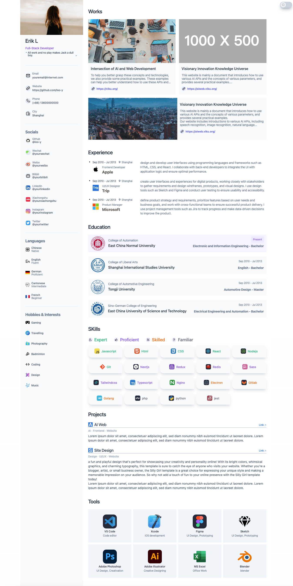
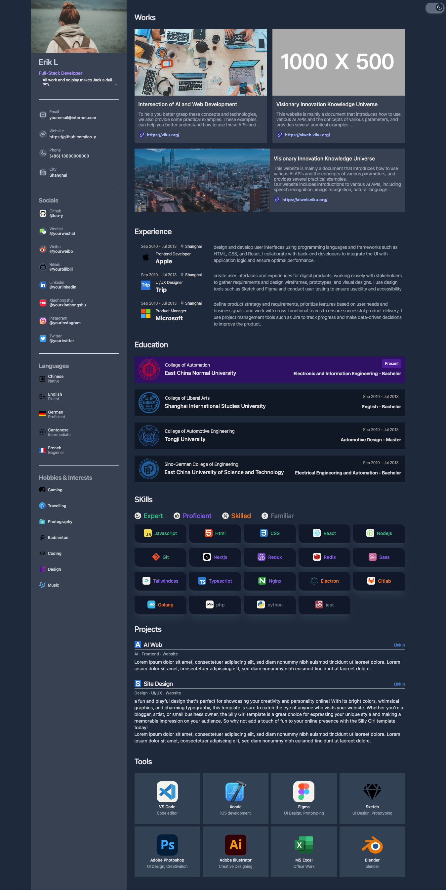
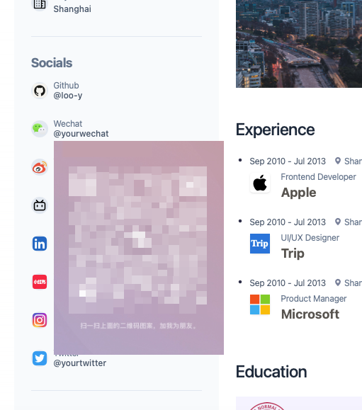

[中文](./ChineseReadme.md)


### DEMO
You can view <b>[demo](https://aboutme.viku.org/)</b> here, which is deployed on Cloudflare Pages. Alternatively, you can build this project locally to obtain the static files and deploy them to any static server of your choice.
## Project Overview

This project is a pure front-end website based on the Next.js framework, designed to showcase and introduce personal information. The website's style and structure are based on the Figma public template [Supa Resume](https://www.figma.com/community/file/1087586245868299560).
<br />
The website already includes icons for some social media and office tools, and you do not need to manually specify them as the project will automatically search for the corresponding icon based on its name.
<br />
<br />

<br />
Now there is a feature <b>dark mode</b>, with a one-click toggle in the top right corner.
<br />

<br />
display a popvover of QR code on mouse hover.
<br/>

<br />

## Getting Started
Run the development server:
```bash
npm run dev
# or
yarn dev
# or
pnpm dev
```
then visit, <b> http://localhost:3000/en </b>
<br />
## Installation and Deployment
You can generate a pure static page by running npm run build, which can be deployed on various static servers.
```bash
npm run build
# or
yarn build
# or
pnpm build
```

## Configuration and Usage
Before using the project, you need to modify the JSON file under the [app/api/mockinfo/](./app/api/mockinfo/) directory to personalize the settings according to your own information. You can also contact me to add new company or tool icons.

The website currently only supports English content display, but Chinese content display will be added later. You can also try to modify the zh page based on the en page.
<br>